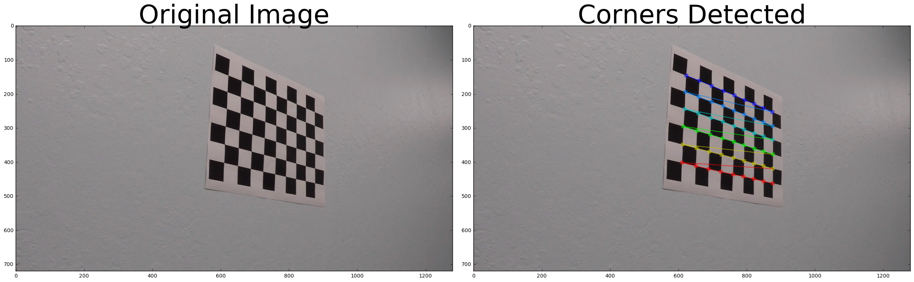
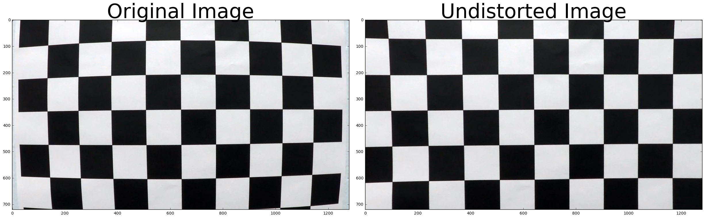
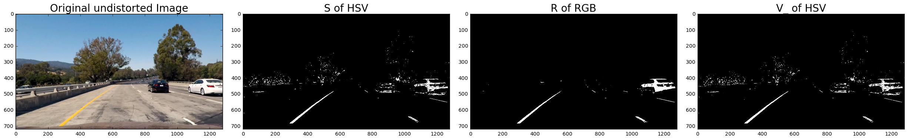
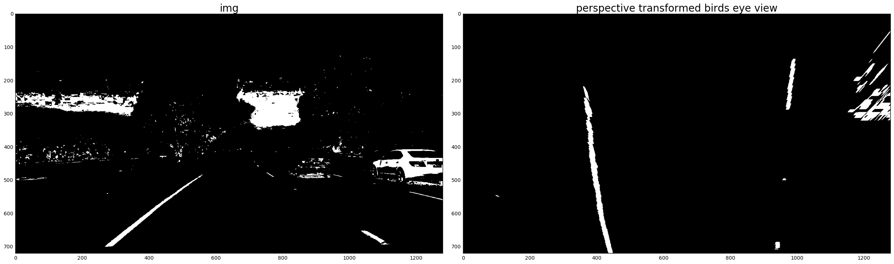
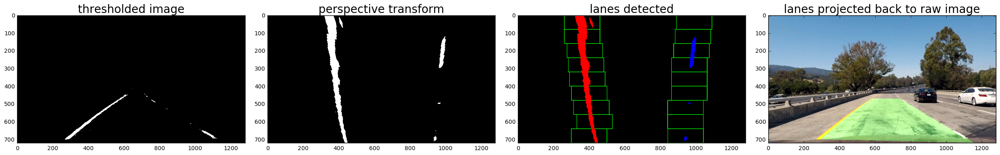
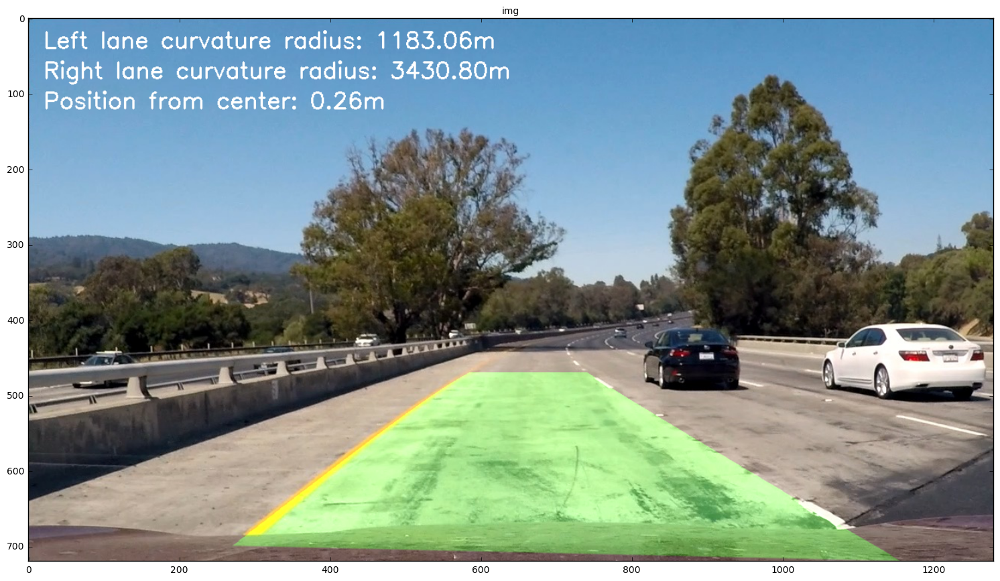

## Advanced Lane Finding Project

The goals / steps of this project are the following:

* Compute the camera calibration matrix and distortion coefficients given a set of chessboard images.
* Apply a distortion correction to raw images.
* Use color transforms, gradients, etc., to create a thresholded binary image.
* Apply a perspective transform to rectify binary image ("birds-eye view").
* Detect lane pixels and fit to find the lane boundary.
* Determine the curvature of the lane and vehicle position with respect to center.
* Warp the detected lane boundaries back onto the original image.
* Output visual display of the lane boundaries and numerical estimation of lane curvature and vehicle position.

---
## Files Submitted
* Advanced Lane Detection.ipynb
>contains exploration and video generation code
* pipeline.py
>contains some helper functions and the Pipeline and Line classes used

---
## First, I'll compute the camera calibration using chessboard images
* create object point array with z=0, x,y evenly distributed for 6x9 chess board
* acquire image points of each image using cv2.findChessboardCorners
* get the camera calibration matrix by passing cv2.calibrateCamera with obj and img points

---
## Detecting Corners


```python
import numpy as np
import cv2
import glob
import matplotlib.pyplot as plt
%matplotlib inline

# prepare object points, like (0,0,0), (1,0,0), (2,0,0) ....,(6,5,0)
objp = np.zeros((6*9,3), np.float32)
objp[:,:2] = np.mgrid[0:9,0:6].T.reshape(-1,2)

# Arrays to store object points and image points from all the images.
objpoints = [] # 3d points in real world space
imgpoints = [] # 2d points in image plane.

# Make a list of calibration images
images = glob.glob('../camera_cal/calibration*.jpg')

# Step through the list and search for chessboard corners
for fname in images:
    img = cv2.imread(fname)
    img_copy = cv2.imread(fname)
    gray = cv2.cvtColor(img,cv2.COLOR_BGR2GRAY)

    # Find the chessboard corners
    ret, corners = cv2.findChessboardCorners(gray, (9,6),None)

    # If found, add object points, image points
    if ret == True:
        objpoints.append(objp)
        imgpoints.append(corners)

        # Draw and display the corners
        cv2.drawChessboardCorners(img, (9,6), corners, ret)
        #break

# show a sample image
f, (ax1, ax2) = plt.subplots(1, 2, figsize=(24, 9))
f.tight_layout()
ax1.imshow(img_copy)
ax1.set_title('Original Image', fontsize=50)
ax2.imshow(img)
ax2.set_title('Corners Detected', fontsize=50)
plt.subplots_adjust(left=0., right=1, top=0.9, bottom=0.)
plt.show()
```





## Calibration


```python
#sample undistorted chessboard to check calibration done properly or not

%matplotlib inline
ret, mtx, dist, rvecs, tvecs = cv2.calibrateCamera(objpoints, imgpoints, gray.shape[::-1], None, None)

for fname in images:
    img = cv2.imread(fname)
    dst = cv2.undistort(img, mtx, dist, None, mtx)
    
    f, (ax1, ax2) = plt.subplots(1, 2, figsize=(24, 9))
    f.tight_layout()
    ax1.imshow(img)
    ax1.set_title('Original Image', fontsize=50)
    ax2.imshow(dst)
    ax2.set_title('Undistorted Image', fontsize=50)
    plt.subplots_adjust(left=0., right=1, top=0.9, bottom=0.)
    plt.show()
    break
```





## Exploration for Lane detection using color and sobel thresholding

### Helper functions


```python
#thresholding function
def th(img, min_, max_):
    img = np.copy(img)
    thresh = (min_, max_)
    binary = np.zeros_like(img)
    binary[(img > thresh[0]) & (img <= thresh[1])] = 1
    return binary

#using S from HLS, V from HSV, R from RGB to detect lane lines
def color_pipeline(img):
    img = np.copy(img)
    #add threshold values as inputs later
    #img = mpimg.imread(fname)
    gray = cv2.cvtColor(img,cv2.COLOR_BGR2GRAY)
    hls = cv2.cvtColor(img, cv2.COLOR_RGB2HLS)
    hsv = cv2.cvtColor(img, cv2.COLOR_RGB2HSV)
    S = hls[:,:,2]#
    R = img[:,:,0]#
    V_ = hls[:,:,2]#
    th_img = th(S,200,255) + 2*th(R,220,255) + th(V_,200,255)
    th_img = th(th_img, 1,4)
    return th_img

#sobel thrhresholded image in any given input dimension x or y
def abs_sobel_thresh(img, orient, sobel_kernel, thresh):
    img = np.copy(img)
    thresh_min = thresh[0]
    thresh_max = thresh[1]
    gray = cv2.cvtColor(img, cv2.COLOR_RGB2GRAY)
    if orient == 'x':
        abs_sobel = np.absolute(cv2.Sobel(gray, cv2.CV_64F, 1, 0, ksize=sobel_kernel))
    if orient == 'y':
        abs_sobel = np.absolute(cv2.Sobel(gray, cv2.CV_64F, 0, 1, ksize=sobel_kernel))
    scaled_sobel = np.uint8(255*abs_sobel/np.max(abs_sobel))
    binary_output = np.zeros_like(scaled_sobel)
    binary_output[(scaled_sobel >= thresh_min) & (scaled_sobel <= thresh_max)] = 1
    return binary_output

#combine color thresholding and sobel edges
def color_edges_pipeline(img):
    img = np.copy(img)
    gradx = abs_sobel_thresh(img, orient='x', sobel_kernel=5, thresh=(10, 25))
    color_th = color_pipeline(img)
    final_img = gradx+color_th
    final_th_img = th(final_img,0,2)
    #return final_th_img
    #return gradx
    return color_th
    #return final_img

#function written for displaying color and edges components separately
def display_pipeline(img,mtx,dist):
    img = np.copy(img)
    img = cv2.undistort(img, mtx, dist, None, mtx)
    #print(img)
    gradx = abs_sobel_thresh(img, orient='x', sobel_kernel=5, thresh=(50, 100))
    #print(gradx)
    color_th = color_pipeline(img)
    #print(color_th)
    color_binary = np.dstack((np.zeros_like(gradx).astype(np.float), gradx, color_th))
    #print(color_binary)
    #return color_th
    #return gradx
    return color_binary
```


```python
##show test images
import matplotlib.image as mpimg
%matplotlib inline
images = glob.glob('../test_images/test*.jpg')

for fname in images:
    fsize = 20
    img = mpimg.imread(fname)
    gray = cv2.cvtColor(img,cv2.COLOR_BGR2GRAY)
    hls = cv2.cvtColor(img, cv2.COLOR_RGB2HLS)
    hsv = cv2.cvtColor(img, cv2.COLOR_RGB2HSV)
    S = hls[:,:,2]#
    R = img[:,:,0]#
    V_ = hls[:,:,2]#
    
    f, (ax1, ax2, ax3, ax4) = plt.subplots(1, 4, figsize=(24, 9))
    f.tight_layout()
    ax1.imshow(cv2.undistort(img, mtx, dist, None, mtx))
    ax1.set_title('Original undistorted Image', fontsize=fsize)
    ax2.imshow(th(S,200,255), cmap='gray')
    ax2.set_title('S of HSV', fontsize=fsize)
    ax3.imshow(th(R,240,255), cmap='gray')
    ax3.set_title('R of RGB', fontsize=fsize)
    ax4.imshow(th(V_,200,255), cmap='gray')
    ax4.set_title('V_ of HSV', fontsize=fsize)
    plt.subplots_adjust(left=0., right=1, top=0.9, bottom=0.)
    plt.show()
    
    f, (ax1, ax2) = plt.subplots(1, 2, figsize=(24, 9))
    f.tight_layout()
    ax1.imshow(color_edges_pipeline(img), cmap='gray')
    ax1.set_title('color snd edges combined thresholded', fontsize=fsize)
    ax2.imshow(display_pipeline(img,mtx,dist))
    ax2.set_title('color and edges components color=blue, edges-green', fontsize=fsize)
    plt.subplots_adjust(left=0., right=1, top=0.9, bottom=0.)
    plt.show()
    break
```





## Perspective Transform

* done to get birds eye view of lanes
* makes it easy to extract actual lanes, curvature of lanes and the position of car wrt center
* src and dst points of warp function determined empirically


```python
src = np.float32(
    [[250, 700],
     [600, 470],
     [720, 470],
     [1120, 720]])

dst = np.float32(
    [[425, 720],
     [425, 0],
     [920,0],
    [920, 720]])

#function to return matrices for perspective transform
def transform_perspective(src, dst):
    M = cv2.getPerspectiveTransform(src, dst)
    Minv = cv2.getPerspectiveTransform(dst, src)
    return M, Minv

m, inv = transform_perspective(src, dst)

images = glob.glob('../test_images/test*.jpg')
for fname in images:
    img=cv2.imread(fname)
    img = cv2.undistort(img, mtx, dist, None, mtx)
    img_size = (img.shape[1], img.shape[0])
    warped = cv2.warpPerspective(color_edges_pipeline(img), m, img_size, flags=cv2.INTER_LINEAR)
    f, (ax1, ax2) = plt.subplots(1, 2, figsize=(24, 9))
    f.tight_layout()
    ax1.imshow(color_edges_pipeline(img), cmap='gray')
    ax1.set_title('thresholded', fontsize=fsize)
    ax2.imshow(warped, cmap='gray')
    ax2.set_title('perspective transformed birds eye view', fontsize=fsize)
    plt.subplots_adjust(left=0., right=1, top=0.9, bottom=0.)
    plt.show()
    break
```





## Detecting Lanes from Perspective Transformed Image

* get_lanes function defined to get the lane lines from perspective transformed image
* takes binary warped image and outputs a detected lane with left and right lanes separate
>* pixel values along each column in the binary warped image are added
>* highest peaks would indicate a good starting point for the x-position of base of lane lines
>* after the starting pixes are obtained we begin restricted search of lane pixels
>* image is divided in 9 row windows of equal height
>* search begins from lowest window
>* then proceeds up with window center being adjusted according to the x-mean of detected lane points


```python
#function to extract region of interest from the image so that only lanes get transformed, 
# and the other detected points near lane donot contaminate the transformed image
def extract_ROI(image):
    # Pull out the x and y sizes and make a copy of the image
    ysize = image.shape[0]
    xsize = image.shape[1]
    region_select = np.copy(image)

    # Define a triangle region of interest 
    # Keep in mind the origin (x=0, y=0) is in the upper left in image processing
    # Note: if you run this code, you'll find these are not sensible values!!
    # But you'll get a chance to play with them soon in a quiz 
    left_bottom = [0, ysize]
    right_bottom = [xsize, ysize]
    apex = [xsize/2, 400]

    # Fit lines (y=Ax+B) to identify the  3 sided region of interest
    # np.polyfit() returns the coefficients [A, B] of the fit
    fit_left = np.polyfit((left_bottom[0], apex[0]), (left_bottom[1], apex[1]), 1)
    fit_right = np.polyfit((right_bottom[0], apex[0]), (right_bottom[1], apex[1]), 1)
    fit_bottom = np.polyfit((left_bottom[0], right_bottom[0]), (left_bottom[1], right_bottom[1]), 1)

    # Find the region inside the lines
    XX, YY = np.meshgrid(np.arange(0, xsize), np.arange(0, ysize))
    region_thresholds = (YY > (XX*fit_left[0] + fit_left[1])) & \
                        (YY > (XX*fit_right[0] + fit_right[1])) & \
                        (YY < (XX*fit_bottom[0] + fit_bottom[1]))

    # Color pixels red which are inside the region of interest
    region_select[~region_thresholds] = 0
    return region_select


def get_lanes(binary_warped):
    # Take a histogram of the bottom half of the image
    histogram = np.sum(binary_warped[binary_warped.shape[0]/2:,:], axis=0)

    # Create an output image to draw on and  visualize the result
    out_img = np.dstack((binary_warped, binary_warped, binary_warped))*255

    # Finding peak of the left and right halves of the histogram
    # These will be the starting point for the left and right lines
    midpoint = np.int(histogram.shape[0]/2)
    leftx_base = np.argmax(histogram[:midpoint])
    rightx_base = np.argmax(histogram[midpoint:]) + midpoint

    # Number of sliding windows
    nwindows = 9

    # Height of windows
    window_height = np.int(binary_warped.shape[0]/nwindows)

    # Identifing the x and y positions of all nonzero pixels in the image
    # get all y and x coordinates of nonzero points
    nonzero = binary_warped.nonzero()
    nonzeroy = np.array(nonzero[0])
    nonzerox = np.array(nonzero[1])

    # Current positions to be updated for each window
    leftx_current = leftx_base
    rightx_current = rightx_base

    # Margin in which to search
    margin = 100

    # Minimum number of pixels found to recenter window
    minpix = 50

    # Empty lists to receive left and right lane pixel indices
    left_lane_inds = []
    right_lane_inds = []

    # Steping through windows one by one
    for window in range(nwindows):
        # Identify window boundaries in x and y (and right and left)
        win_y_low = binary_warped.shape[0] - (window+1)*window_height
        win_y_high = binary_warped.shape[0] - window*window_height
        win_xleft_low = leftx_current - margin
        win_xleft_high = leftx_current + margin
        win_xright_low = rightx_current - margin
        win_xright_high = rightx_current + margin

        # Drawing the windows on the visualization image
        cv2.rectangle(out_img,(win_xleft_low,win_y_low),(win_xleft_high,win_y_high),(0,255,0), 2) 
        cv2.rectangle(out_img,(win_xright_low,win_y_low),(win_xright_high,win_y_high),(0,255,0), 2) 

        # Identifing the nonzero pixels in x and y within the window
        # returns indices, not values
        good_left_inds = ((nonzeroy >= win_y_low) & (nonzeroy < win_y_high) & (nonzerox >= win_xleft_low) & (nonzerox < win_xleft_high)).nonzero()[0]
        good_right_inds = ((nonzeroy >= win_y_low) & (nonzeroy < win_y_high) & (nonzerox >= win_xright_low) & (nonzerox < win_xright_high)).nonzero()[0]

        # Appending these indices to the lists
        left_lane_inds.append(good_left_inds)
        right_lane_inds.append(good_right_inds)

        # Recenter next window on their mean position
        if len(good_left_inds) > minpix:
            leftx_current = np.int(np.mean(nonzerox[good_left_inds]))
        if len(good_right_inds) > minpix:        
            rightx_current = np.int(np.mean(nonzerox[good_right_inds]))

    # Concatenating the arrays of indices
    left_lane_inds = np.concatenate(left_lane_inds)
    right_lane_inds = np.concatenate(right_lane_inds)

    # Extracting left and right line pixel positions
    leftx = nonzerox[left_lane_inds]
    lefty = nonzeroy[left_lane_inds] 
    rightx = nonzerox[right_lane_inds]
    righty = nonzeroy[right_lane_inds] 

    # Fit a second order polynomial to each
    left_fit = np.polyfit(lefty, leftx, 2)
    right_fit = np.polyfit(righty, rightx, 2)

    ## Visualization
    # x = f(y) quadratic fit
    ploty = np.linspace(0, binary_warped.shape[0]-1, binary_warped.shape[0] )
    left_fitx = left_fit[0]*ploty**2 + left_fit[1]*ploty + left_fit[2]
    right_fitx = right_fit[0]*ploty**2 + right_fit[1]*ploty + right_fit[2]

    out_img[nonzeroy[left_lane_inds], nonzerox[left_lane_inds]] = [255, 0, 0]
    out_img[nonzeroy[right_lane_inds], nonzerox[right_lane_inds]] = [0, 0, 255]
    
    return out_img, left_fitx, right_fitx, left_fit, right_fit


images = glob.glob('../test_images/test*.jpg')

for fname in images:
    
    #img = cv2.imread(fname)
    img = mpimg.imread(fname)
    
    #remove distortion
    undistort = cv2.undistort(img, mtx, dist, None, mtx)
    img = undistort
    
    #image size
    img_size = (img.shape[1], img.shape[0])
    
    #apply color_edges_pipeline defined in earlier Cells
    #warp the region of interest
    warped = cv2.warpPerspective(extract_ROI(color_edges_pipeline(img)), m, img_size, flags=cv2.INTER_LINEAR)
        
    # Create an image to draw the lines on
    warp_zero = np.zeros_like(warped).astype(np.uint8)
    color_warp = np.dstack((warp_zero, warp_zero, warp_zero))
    
    out_img, left_fitx, right_fitx, left_fit, right_fit = get_lanes(warped)

    # Recast the x and y points into usable format for cv2.fillPoly()
    ploty = np.linspace(0, img.shape[0]-1, img.shape[0] )
    pts_left = np.array([np.transpose(np.vstack([left_fitx, ploty]))])
    pts_right = np.array([np.flipud(np.transpose(np.vstack([right_fitx, ploty])))])
    pts = np.hstack((pts_left, pts_right))

    # Draw the lane onto the warped blank image
    cv2.fillPoly(color_warp, np.int_([pts]), (0,255, 0))

    # Warp the blank back to original image space using inverse perspective matrix (Minv)
    newwarp = cv2.warpPerspective(color_warp, inv, img_size) 
    # Combine the result with the original image
    result = cv2.addWeighted(img, 1, newwarp, 0.3, 0)
    
    f, (ax1, ax2, ax3, ax4) = plt.subplots(1, 4, figsize=(24, 9))
    f.tight_layout()
    ax1.imshow(extract_ROI(color_edges_pipeline(img)), cmap='gray')
    ax1.set_title('thresholded image', fontsize=fsize)
    ax4.imshow(result, cmap='gray')
    ax4.set_title('lanes projected back to raw image', fontsize=fsize)
    
    warped1 = cv2.warpPerspective(extract_ROI(color_edges_pipeline(img)), m, img_size, flags=cv2.INTER_LINEAR)
    ax2.imshow(warped1, cmap='gray')
    ax2.set_title('perspective transform', fontsize=fsize)
    
    ax3.imshow(out_img)
    ax3.set_title('lanes detected', fontsize=fsize)
    
    plt.subplots_adjust(left=0., right=1, top=0.9, bottom=0.)
    plt.show()
    
    break
```

    C:\Users\Kaustubh\Anaconda3\envs\tensorflow\lib\site-packages\ipykernel\__main__.py:34: VisibleDeprecationWarning: using a non-integer number instead of an integer will result in an error in the future
    





## Video Processing Pipeline

Pipeline class and Line class are defined in pipeline.py file
functioning of pipeline:-
* scan first frame
* get the lanes (points, curve fit params and curvature)
* check sanity (ideally need to use curvature, parallelism etc. but have used only curvature>500m for now)(500 value was mentioned in project tips and tricks for the test video)
* if sanity passed go ahead with updating Line class params and queues
* if sanity failed 
>* check if it has been failing for last 20 frames
>* if yes rescan the frame for lane
* else go ahead with past detected params

[here I have ignored the remote possibility of sanity failing in first frame itself]

### Radius of curvature
* calculated using the formula provided in the study material
* Line.curvature() function of Line class does the curvature calculation


```python
from pipeline import *
```


```python
src = np.float32(
    [[250, 700],
     [600, 470],
     [720, 470],
     [1120, 720]])

dst = np.float32(
    [[425, 720],
     [425, 0],
     [920,0],
    [920, 720]])

P = pipeline(src, dst, mtx, dist)

images = glob.glob('../test_images/test*.jpg')

for fname in images:
    temp = mpimg.imread(fname)
    img = P.processing_function(temp)
    
    f, (ax1) = plt.subplots(1, 1,figsize=(24, 9))
    f.tight_layout()
    ax1.imshow(img, cmap='gray')
    ax1.set_title('img', fontsize=10)
    
    plt.subplots_adjust(left=0., right=1, top=0.9, bottom=0.)
    plt.show()
    break
```

    C:\Users\Kaustubh\Desktop\SDC-nanodegree\CarND-Advanced-Lane-Lines-master\examples\pipeline.py:9: VisibleDeprecationWarning: using a non-integer number instead of an integer will result in an error in the future
      histogram = np.sum(binary_warped[binary_warped.shape[0]/2:,:], axis=0)
    C:\Users\Kaustubh\Desktop\SDC-nanodegree\CarND-Advanced-Lane-Lines-master\examples\pipeline.py:88: VisibleDeprecationWarning: using a non-integer number instead of an integer will result in an error in the future
      histogram = np.sum(binary_warped[binary_warped.shape[0]/2:,:], axis=0)
    





```python
import imageio
from moviepy.editor import VideoFileClip
from IPython.display import HTML

P.Left.clear_history()
P.Right.clear_history()
white_output = 'project_video_output_final-3.mp4'
clip1 = VideoFileClip("..\project_video.mp4")
white_clip = clip1.fl_image(P.processing_function)
%time white_clip.write_videofile(white_output, audio=False)

HTML("""
<video width="960" height="540" controls>
  <source src="{0}">
</video>
""".format(white_output))
```

    C:\Users\Kaustubh\Anaconda3\envs\tensorflow\lib\site-packages\skimage\filter\__init__.py:6: skimage_deprecation: The `skimage.filter` module has been renamed to `skimage.filters`.  This placeholder module will be removed in v0.13.
      warn(skimage_deprecation('The `skimage.filter` module has been renamed '
    C:\Users\Kaustubh\Anaconda3\envs\tensorflow\lib\site-packages\moviepy\audio\io\readers.py:110: VisibleDeprecationWarning: using a non-integer number instead of an integer will result in an error in the future
      self.nchannels))
    C:\Users\Kaustubh\Desktop\SDC-nanodegree\CarND-Advanced-Lane-Lines-master\examples\pipeline.py:9: VisibleDeprecationWarning: using a non-integer number instead of an integer will result in an error in the future
      histogram = np.sum(binary_warped[binary_warped.shape[0]/2:,:], axis=0)
    C:\Users\Kaustubh\Desktop\SDC-nanodegree\CarND-Advanced-Lane-Lines-master\examples\pipeline.py:88: VisibleDeprecationWarning: using a non-integer number instead of an integer will result in an error in the future
      histogram = np.sum(binary_warped[binary_warped.shape[0]/2:,:], axis=0)
    

    
    MoviePy: building video file project_video_output_final-3.mp4
    ----------------------------------------
    
    Writing video into project_video_output_final-3.mp4
    

    100%|██████████████████████████████████████████████████████████████████████████████████████████████████████████████████████████████| 1210/1210 [11:34<00:00,  1.69it/s]
    

    Done writing video in project_video_output_final-3.mp4 !
    Your video is ready !
    Wall time: 11min 38s
    


<video width="960" height="540" controls>
  <source src="project_video_output_final-3.mp4">
</video>


### Project video output is in project_video_output_final.mp4 file in default submission folder

## Discussion

* Pipeline seems to be working fine on easy test video.
* It will falter when there is huge variation in  lighting conditions and when we have to regain the lane if lost there
* In above case contrast enhancement can be applied for nullifying lighting variations
* GPS/Compass/Lidar data can be fused with their own confidence paramters to make a more restricted search for lanes, when image processing simply dosen't cut it, which could be the case in varying lighting conditions, damaged road paint etc.


```python

```
